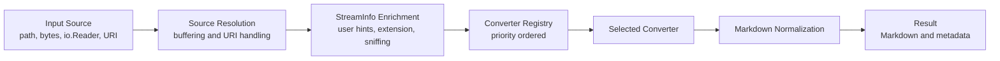
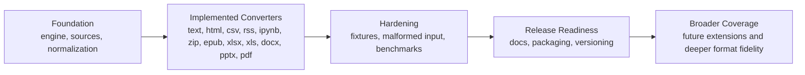

# Inkbite

## Abstract

Inkbite is a Go-native document-to-Markdown extraction system intended for
retrieval, indexing, and large-language-model context preparation. The project
investigates a deliberately constrained question: can a self-contained binary
produce sufficiently useful surface representations of heterogeneous documents
without relying on external executables, layout reconstruction, or
format-specific overfitting?

The present answer pursued by Inkbite is pragmatic rather than maximalist.
Inkbite prioritizes deterministic behavior, graceful degradation, and readable
Markdown over visual fidelity. Its purpose is not to recreate the appearance of
source documents, but to recover the structural signals most valuable for
downstream reasoning systems: titles, headings, paragraphs, lists, links,
tables, and section boundaries.

## Research Aim

Inkbite is guided by the following aims:

1. To provide a single Go library and CLI for converting common text-heavy
   document formats into normalized Markdown.
2. To remain self-contained as a deployable artifact, avoiding dependence on
   external binaries for core extraction behavior.
3. To preserve useful semantic structure while accepting reduced fidelity on
   layout-sensitive formats.
4. To support deterministic and typed failure behavior suitable for production
   ingestion pipelines.
5. To establish a modular converter architecture that can be extended without
   weakening the core system contract.

## Working Hypotheses

The project proceeds from three practical hypotheses:

1. For many retrieval-oriented workloads, useful Markdown is more valuable than
   visually faithful reproduction.
2. A conservative, self-contained implementation can cover a substantial share
   of common ingest needs while remaining easier to deploy and reason about.
3. Reduced-scope extraction for complex formats such as DOCX and PDF can still
   be operationally successful if headings, paragraphs, links, and simple
   tables are preserved with reasonable consistency.

## System Overview

Inkbite accepts multiple input forms, resolves them into a seekable stream,
infers type information, routes the stream through a priority-ordered converter
registry, and applies a final normalization pass before returning Markdown.

Figure 1. End-to-end conversion pipeline.



The system is organized around a small public API and a set of focused
converters. This architecture is intended to keep the engine stable while
allowing new format support to be added incrementally and with clear failure
boundaries.

## Design Principles

### 1. Determinism over fidelity

Inkbite prefers reproducible extraction to high-variance heuristics. When a
format admits only partial recovery, the project favors incomplete but readable
Markdown over brittle layout emulation.

### 2. Self-contained execution

The core project is designed to operate without required external executables.
This principle improves portability, simplifies deployment, and keeps failure
modes legible.

### 3. Useful structure over visual appearance

The most important output properties are semantic rather than visual. The
system therefore focuses on preserving headings, paragraphs, links, lists,
tables, and clear section boundaries.

### 4. Graceful degradation

Unsupported or malformed inputs should fail clearly rather than crash. Complex
formats may degrade to simpler surface text when higher-fidelity recovery is
not justified.

### 5. Modular extensibility

Each converter is intended to be independently understandable, testable, and
replaceable without distorting the engine contract.

## Implemented Scope

The repository currently includes the following built-in converter set:

| Format | Status | Notes |
| --- | --- | --- |
| Plain text | Implemented | Normalized text output |
| HTML | Implemented | DOM-to-Markdown conversion |
| CSV | Implemented | Markdown table output |
| JSON and generic XML | Implemented via text path | Treated as text unless specialized routing applies |
| RSS and Atom | Implemented | Feed and entry extraction |
| IPYNB | Implemented | Markdown and code-cell extraction |
| ZIP | Implemented | Recursive conversion of supported entries |
| EPUB | Implemented | Metadata plus spine extraction |
| XLSX | Implemented | Sheet-wise Markdown table output |
| DOCX | Implemented, reduced scope | Headings, paragraphs, links, simple tables |
| PDF | Implemented, reduced scope | Pure-Go text extraction with best-effort table heuristics |
| PPTX | Implemented, reduced scope | Slide titles, body text, notes, simple tables |
| XLS | Implemented, basic scope | Legacy workbook tables with formatted dates and numerics; formula handling remains limited |

## Explicit Non-Goals for the Current MVP

The present project does not attempt to provide:

- exact parity with Python MarkItDown
- OCR
- full PDF layout reconstruction
- DOCX comments, equations, or track-changes support
- PowerPoint chart or image-caption intelligence
- Outlook `.msg` support
- audio transcription
- multimodal image captioning
- plugin infrastructure in the MVP
- remote extraction backends as part of the core self-contained binary

## Current Repository State

At the current stage of development, the project should be understood as a
strong early MVP rather than a finished release artifact.

The repository presently has:

- a working Go module and CLI
- a functioning converter registry and dispatch engine
- support for local files, `[]byte`, `io.Reader`, `io.ReadSeeker`, `file:` URIs,
  `data:` URIs, and opt-in `http(s)` sources
- reduced-scope PPTX extraction for slide titles, body text, notes, and simple tables
- a self-contained PDF path implemented in pure Go
- basic legacy XLS extraction with formatted date and numeric rendering
- a passing Go test suite across the currently implemented packages
- build automation, multi-platform CI coverage, and tagged release packaging

The repository does not yet have:

- broad real-world legacy XLS regression coverage beyond the current basic scope
- broad malformed-input and performance hardening
- broader publication-oriented documentation

## Operational Interface

### Build

```bash
make build
```

The module selects Go 1.26.5; with the default `GOTOOLCHAIN=auto`, the Go
command downloads that toolchain when necessary.

### Verify

```bash
make ci
```

## Managed Components

The CLI now includes a managed-component foundation for optional capabilities:

```bash
inkbite components list
inkbite doctor
inkbite config show
inkbite install ocr
inkbite install ocr --provider paddleocr
```

At the current stage, `install ocr` installs and validates the managed OCR
helper foundation and config path. The default `builtin` provider stays light
and fast for development. An experimental `paddleocr` provider is also
available for CPU-oriented setup through a managed Python `venv`, with streamed
install progress, pinned Python compatibility fixes, and a quieter self-test
path. OCR-backed document conversion wiring remains follow-on work.

## Optional Visual-PDF Compiler

`visualpdf` is a build-time package API for applications that need a
fidelity-gated offline visual representation of a local PDF. It is not part of
the normal self-contained Markdown converter and never changes its behavior.
The compiler requires a pinned local Poppler toolchain and a versioned visual
profile that names the qualified offline renderer and calibration evidence.

For every PDF page it retains the source, emits source-derived `semantic.md`
and positioned `text-runs.json`, renders a deterministic PDF reference raster,
and attempts a Poppler/Cairo outlined-glyph SVG. A page becomes `verified_svg`
only when the profile renderer passes its committed visual gate; otherwise a
verified reference `raster_fallback` is emitted with a deterministic
remediation item. The source-aware text candidate is currently recorded as
unavailable: its eligibility diagnostics require a source font program,
ToUnicode glyph mapping, approved embedding policy, and pinned WOFF2 subsetter,
but an eligible positioned-text SVG emitter has not yet been implemented.
No OCR is substituted for PDF-source text. Painted PDF raster XObjects,
including images reached through Form XObjects, are also retained in
integrity-hashed page sidecars: supported JPEG streams keep
their original bytes, while supported Flate, CCITT, and raw streams become
lossless PNGs. Transparency masks remain separate sidecars; they are not
flattened into the image. Each image and mask sidecar records every PDF-space
`[a b c d e f]` placement of its painted image XObject. Separately, PNG and JPEG image data embedded by the
outlined SVG are written byte-for-byte as declared package-local candidate
assets while preserving the SVG image placement. The rewritten candidate must
pass the same visual gate before it can become the display asset.

```bash
inkbite visual pdf \
  --input /local/procedure.pdf \
  --output /new/visual-package \
  --poppler-dir /pinned/poppler/bin \
  --poppler-version 26.07.0 \
  --woff2-subsetter /pinned/woff2-subsetter \
  --woff2-subsetter-version 1.0.0 \
  --profiles ./visualpdf/profiles/iris-offline-webview-v3.json
```

The checked-in v3 profile is intentionally unqualified and fails closed: its
renderer path is a placeholder and its hash-pinned calibration report has a
pending review. A usable profile needs a qualified offline-WebView renderer,
an integrity-verified comparison corpus, and an explicit approved review with
reviewer and timestamp. Its numeric pixel limits live only in that reviewed
report and are bound to the compiler's named comparison algorithm. The
compiler writes `manifest.json` with source and asset hashes, dimensions,
candidates, verification evidence, semantic artifacts, and remediation queue.
This evidence shape follows the measured-corpus and provenance discipline in
the sibling [shrinkray](https://github.com/crucible-energy/shrinkray) project;
Inkbite keeps the implementation local because this gate measures renderer
fidelity, not image-codec tradeoffs.

Each verification also preserves the raw different-pixel count and exclusive
difference bounding box alongside the calibrated changed-pixel result. Those
raw observations support review and calibration; they do not auto-approve a
profile or substitute for the versioned corpus and explicit review.

### Example CLI Usage

Convert a local file:

```bash
inkbite ./report.pdf
```

Read from standard input:

```bash
cat notes.html | inkbite
```

Write output to a file:

```bash
inkbite -o output.md ./paper.docx
```

Provide explicit type hints:

```bash
inkbite --mime-type text/plain --charset utf-8 ./sample.dat
```

Allow remote retrieval explicitly:

```bash
inkbite --http https://example.org/feed.xml
```

List registered converters:

```bash
inkbite --list-formats
```

## Codex Skill

The repository ships a Codex skill at [skills/inkbite/SKILL.md](skills/inkbite/SKILL.md).
Use it when an agent should learn the intended Inkbite workflow without requiring
an MCP server.

Install it into the default local skill directory with:

```bash
mkdir -p "${CODEX_HOME:-$HOME/.codex}/skills"
cp -R ./skills/inkbite "${CODEX_HOME:-$HOME/.codex}/skills/"
```

## Library Use

```go
package main

import (
    "context"
    "fmt"

    inkbite "github.com/LynnColeArt/Inkbite"
    "github.com/LynnColeArt/Inkbite/builtins"
)

func main() {
    engine := inkbite.New()
    builtins.RegisterDefaultConverters(engine)

    result, err := engine.Convert(context.Background(), "./document.pdf", nil, inkbite.ConvertOptions{})
    if err != nil {
        panic(err)
    }

    fmt.Println(result.Markdown)
}
```

## Development Trajectory

The near-term trajectory of the project is to consolidate the current engine,
deepen hardening across the implemented formats, and formalize release-ready
packaging and documentation.

Figure 2. Development trajectory.



## What Inkbite Hopes to Achieve

Inkbite aims to become a reliable scholarly and production-oriented reference
for self-contained document ingestion in Go. Its ambition is modest but useful:
to show that a carefully scoped extractor can be operationally valuable without
becoming opaque, dependency-heavy, or fragile. If successful, the project will
offer a principled foundation for text-oriented ingest workflows in which
clarity, determinism, and deployability matter more than maximal visual
fidelity.
